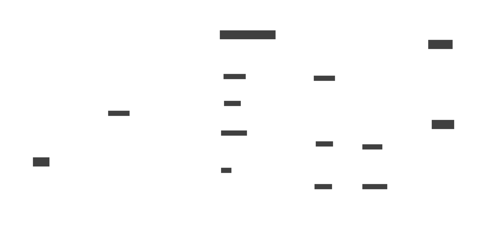

# Architecture

OpenHands Cloud is deployed as two Kubernetes clusters, the **Core App cluster** and the **Runtime cluster**.

## OpenHands components

**OpenHands API** has the main entrypoints for using OpenHands. This includes the user interface as well as webhooks such as the GitHub / GitLab resolvers.

**Runtime API** manages the Runtime pods. It maintains a pool of waiting runtime pods (called "warm runtimes") and assigns them to conversations on request.

**Runtimes** are the isolated execution environments that run OpenHands agents.

**Image Loader** is a daemon that ensures the Runtime image is cached on every node in the Runtime cluster

## Third-party components

* Kubernetes
* Postgres
* Redis
* Keycloak
* LiteLLM Proxy
* Langfuse
* Clickhouse
* AI Language Models

## Cloud services

These will be implemented differently depending on which cloud provider you use.

* Load balancer
* Conversation bucket (usually a blob-store like S3)
